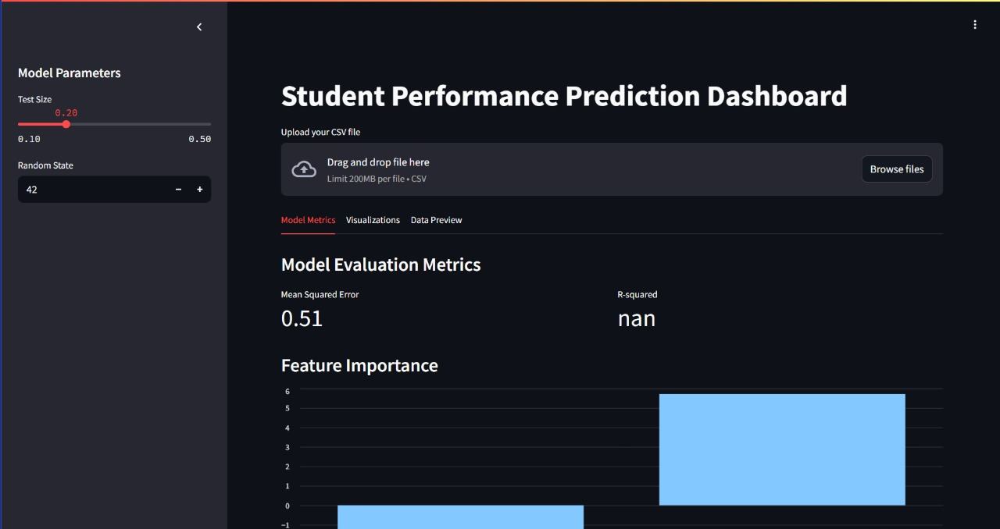
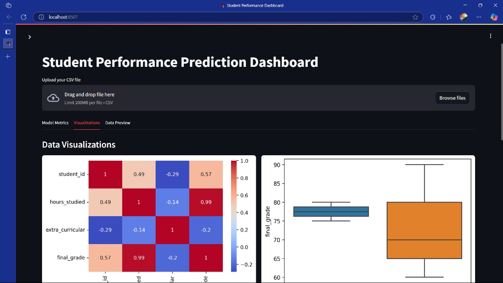

<h1 align="center">🎓 Student Performance Dashboard</h1>

<p align="center">
  <b>Analyze, Visualize, and Predict student performance using Python, Streamlit, and Vertex AI!</b><br>
  <i>Interactive · Educational · Cloud-ready</i>
</p>

<p align="center">
  <a href="#-preview">🎥 Preview</a> •
  <a href="#-project-overview">📌 Overview</a> •
  <a href="#-installation-guide">⚙️ Setup</a> •
  <a href="#️-streamlit-dashboard">🖥️ Dashboard</a> •
  <a href="#-notebook-analysis">📒 Notebook</a> •
  <a href="#-vertex-ai-integration">☁️ Cloud</a> •
  <a href="#-structure--files">🗂️ Structure</a> •
  <a href="#-contributing">🤝 Contribute</a>
</p>

---

## 🎥 Preview


> *Live Demo* (Deploy to [Streamlit Cloud](https://streamlit.io/cloud) or run locally)

<p align="center">
  
</p>


## 📌 Project Overview

🚀 A complete end-to-end project for data analysis and machine learning on student performance datasets.

- 🧪 Exploratory Data Analysis with **Jupyter Notebook**
- 📈 Visual Dashboard using **Streamlit**
- 🤖 ML Predictions via **scikit-learn**
- ☁️ Optional Cloud Deployment via **Google Vertex AI**

---

## ⚙️ Installation Guide

### ✅ Step 1: Clone the Repo

```bash
git clone https://github.com/PriyanshuKSharma/student-performance-dashboard.git
cd student-performance-dashboard
```

### ✅ Step 2: Create & Activate Virtual Environment

<details>
<summary><b>🪟 Windows</b></summary>

```bash
python -m venv ds-env
ds-env\Scripts\activate
```
</details>

<details>
<summary><b>🐧 macOS/Linux</b></summary>

```bash
python3 -m venv ds-env
source ds-env/bin/activate
```
</details>

### ✅ Step 3: Install Dependencies

```bash
pip install -r requirements.txt
```

> Or install manually:
```bash
pip install pandas numpy matplotlib seaborn scikit-learn streamlit
```

---

## 🖥️ Streamlit Dashboard

### 🚀 Run the App

```bash
streamlit run dashboard.py
```

🔗 Open in browser: [http://localhost:8501](http://localhost:8501)

<p align="center">
  
</p>

### 🎯 Features

- Upload your own Excel/CSV datasets
- Analyze subject scores, pass/fail rates, attendance
- Predict future student performance
- Charts: Bar plots, heatmaps, histograms

---

## 📒 Notebook Analysis

Open `student_performance_colab.ipynb` in Jupyter or Google Colab.

### 📍 What's Inside:

- ✅ Clean and preprocess the data
- 📊 Visualize trends and correlations
- 🧠 Train ML models (Linear, Decision Tree, etc.)
- 📈 Evaluate metrics (MSE, R², Accuracy)

### 💾 Save Model

```python
import joblib
joblib.dump(model, 'model.pkl')
```

---

## ☁️ Vertex AI Integration (Advanced)

Use `vertex_ai_integration.py` to train and deploy models on Google Cloud.

### 🔧 Prerequisites

- Google Cloud account
- Enable Vertex AI + Billing
- Install Google Cloud SDK

```bash
gcloud init
```

📂 This script handles:

- Upload to Cloud Storage
- Model training
- Deployment & prediction endpoint

---

## 🗂️ Structure & Files

| File / Folder                       | Description                            |
|------------------------------------|----------------------------------------|
| `dashboard.py`                     | Streamlit app                          |
| `student_performance_colab.ipynb`  | Notebook for EDA + ML                  |
| `student_performance.xlsx`         | Original dataset                       |
| `generated_student_performance.xlsx`| Synthetic/generated version            |
| `vertex_ai_integration.py`         | GCP Vertex AI deployment script        |
| `ds-env/`                          | Virtual environment (excluded)         |
| `requirements.txt`                 | Python dependencies                    |

---

## 🌐 Deployment Options

### ✅ Option 1: Local

```bash
streamlit run dashboard.py
```

### ☁️ Option 2: Streamlit Cloud

- Push your code to GitHub
- Go to [Streamlit Cloud](https://streamlit.io/cloud)
- Connect your repo → Deploy instantly!

---

## 🤝 Contributing

We welcome contributions! Here’s how:

1. 🍴 Fork this repo
2. 🛠️ Create your branch: `git checkout -b feature/feature-name`
3. ✅ Commit your changes
4. 🚀 Push to the branch: `git push origin feature-name`
5. 🔁 Open a pull request

---

## ⚖️ License

This project is not licensed.
This is for educational purpose.
---

## 📬 Contact

**👨‍💻 Priyanshu Kumar Sharma**  
📧 [priyanshu17ks@gmail.com](mailto:priyanshu17ks@gmail.com)  
🔗 [GitHub](https://github.com/PriyanshuKSharma)

---

⭐ **If you found this project helpful, please consider giving it a star!** 🌟

